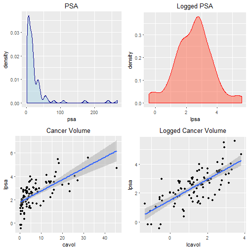
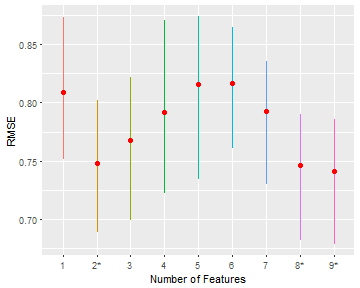
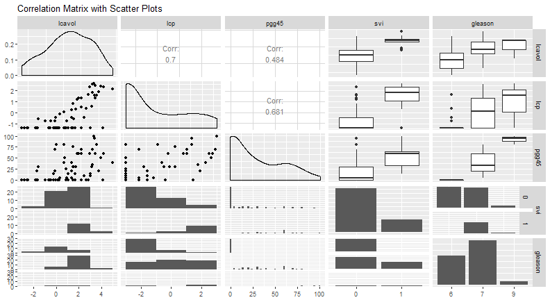
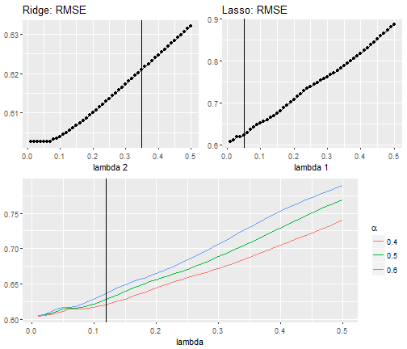

## Background: Anatomy and Function 

  
  
- A gland specific only to males and is vital to overall wellness and sexual health
- Urine excrement via urethra
- Production of seminal fluid via seminal vesical
- A shrowd or capsule covering the prostate 

---

## Background: Prostate specific antigen (PSA)

PSA is a proteins produced by prostate cell and measured as nano-grams per milliliter of a subjects
blood. 

Factors which may effeft PSA levels include:

- ethnicity
- sexual activity
- prostate weight and growth which is naturally linked to aging process.
- benign prostatic hyperplasia (BPA): leading form of noncancerous tumors found in men
- prostate carcinoma (cancer)

---

## Background: Prostate Cancer

Biopsy results are investigated for carcinoma differenciation and a Gleason Score (1-5) is assigned. The most proment scores are summed to give the Gleason Grade (2-10).

3-Tier system:

- GG < 6 not considered
- GG = 6 indicates minor differentiation
- GG = 7 indicates moderate differentiation
- 8 $\leq$ GG $\leq$ 10 is considered highest level of differentiation

---

## Background: Stage 3 cancer

When the carcinoma extends beyond the prostate capsule, this is referred to as stage three cancer, which is sub-divided into three categories:

1. T3a capsulary penetration (cp) of one side of the prostate
2. T3b penetration of both sides of the prostate
3. T3c penetration into the seminal vesicle or seminal vasical invasion (svi)

---

## Data: Predictors of PSA-levels

- volume of a cancer tumor (cavol)
- weight of the prostate (weight)
- measure of benign prostatic hyperplasia (bph)
- age of the subject (age)
- percentage of samples with Gleason grades from 4 to 5 (pgg45)
- amount of capillary penetration (cp)
- indication if any seminal vesicle invasion (svi)
- gleason grade from biopsy (gg)

---

## Data: 

As proposed by Hastie et. al., from the view point of function approximation there are infinitely many such functions to choose from [1].Therefore, some constraint, based on the analyst's belief, is useful in determining $\hat{f}$.

Therefore, some constraint, based on the analyst's belief, is useful in constructing $\hat{f}$. Here we state assumptions: the belief that 

- $\hat{f}$ is:
    - linear in its parameters 
    - linear in its inputs/covariates/features which are independent of one another
- $\hat{f}$ is stochastic due to random error which:
    - is additive
    - has a Gaussian distrubution with mean value = 0, and constant variance
    - are not correlated to the conditional prediction space $\hat{y}$

---

## Data: Transformations

To ensure Normality of residuals, the *target* variable is transformed into a more symetric probability density.

To ensure linearity, explanitory features are also transformed.

All features have been considered for such tranformation. Results are summarized on next slide.

---

## Data: Summary Post Transformation

<table style="text-align:center"><tr><td colspan="7" style="border-bottom: 1px solid black"></td></tr><tr><td style="text-align:left">Statistic</td><td>N</td><td>Mean</td><td>St. Dev.</td><td>Min</td><td>Median</td><td>Max</td></tr>
<tr><td colspan="7" style="border-bottom: 1px solid black"></td></tr><tr><td style="text-align:left">lpsa</td><td>96</td><td>2.482</td><td>1.160</td><td>-0.431</td><td>2.592</td><td>5.583</td></tr>
<tr><td style="text-align:left">lcavol</td><td>96</td><td>1.349</td><td>1.185</td><td>-1.347</td><td>1.453</td><td>3.821</td></tr>
<tr><td style="text-align:left">lweight</td><td>96</td><td>3.629</td><td>0.431</td><td>2.375</td><td>3.614</td><td>4.780</td></tr>
<tr><td style="text-align:left">age</td><td>96</td><td>63.771</td><td>7.425</td><td>41</td><td>65</td><td>79</td></tr>
<tr><td style="text-align:left">lbph</td><td>96</td><td>0.107</td><td>1.457</td><td>-1.386</td><td>0.369</td><td>2.326</td></tr>
<tr><td style="text-align:left">lcp</td><td>96</td><td>-0.199</td><td>1.393</td><td>-1.386</td><td>-0.799</td><td>2.904</td></tr>
<tr><td style="text-align:left">pgg45</td><td>96</td><td>24.479</td><td>28.336</td><td>0</td><td>15</td><td>100</td></tr>
<tr><td colspan="7" style="border-bottom: 1px solid black"></td></tr></table>

<table style="text-align:center"><tr><td colspan="5" style="border-bottom: 1px solid black"></td></tr><tr><td style="text-align:left"></td><td>svi</td><td>Freq</td><td>gleason</td><td>Freq.1</td></tr>
<tr><td colspan="5" style="border-bottom: 1px solid black"></td></tr><tr><td style="text-align:left">1</td><td>0</td><td>75</td><td>6</td><td>35</td></tr>
<tr><td style="text-align:left">2</td><td>1</td><td>21</td><td>7</td><td>56</td></tr>
<tr><td style="text-align:left">3</td><td></td><td></td><td>9</td><td>5</td></tr>
<tr><td colspan="5" style="border-bottom: 1px solid black"></td></tr></table>

---

## Methods: Predictive Models

Define a data set by pairs $(x_1,y_1),(x_2, y_2),\dots,(x_n, y_n)$ where each row vector $x_i$ is a collection of feature measurements given by $(x_{i,1}, x_{i,2},\dots,x_{i,p})^T$, for p features. With a subset of the data learn a statistical model and validate its predictive ability with the remaining data.

-True function *f* which maps $x_i \rightarrow y_i$ is unknowable
$$\begin{align}
&& f(x_i) &= y_i &&\nonumber\\
&& &= E(y_i|x_i)  + \varepsilon_i &&\nonumber\\
\mathit{and\;the\;true\;error\;becomes} && \varepsilon_i &= y_i - E(y_i|x_i) && \hspace{.5in}for\, i = 1,2,\dots,n &&
\end{align}$$
-Estimator function also maps $x_i \rightarrow y_i$ but can be learned
$$\begin{align}
&& \hat{f}(x_i) &= y_i &&\nonumber\\
&& &= \hat{y}_i + \epsilon_i &&\nonumber\\
\mathit{so\;error\;estimator\;becomes} &&  \epsilon_i &= y_i - \hat{y}_i \hspace{.5in}for\, i = 1,2,\dots,n &&
\end{align}$$

---

## Criterion: Residual Sum of Squares

Summing error differences is non informative and not mathematically tractible. Therefore, squared error can be minimized.

$$\begin{align}
\operatorname*{arg\,min\,} RSS(f) & = \operatorname*{arg\,min}_f  \lvert\lvert \pmb{\epsilon} \rvert\rvert^2 \nonumber\\
& = \operatorname*{arg\,min}_f \lvert\lvert\pmb{Y} - E(\pmb{Y} | \pmb{X}^*)\rvert\rvert^2 \nonumber\\
&=  \sum_{i=1}^n(y_i - \hat{y}_i)^2
\end{align}$$

- Result of minimization is the Classical Gaussian model

---

## Criterion: Pros and Cons

Pros

- The shortest $l_2$ distance between observation $y_i$ and prediction/projection $\hat{y}_i$
    - Asymptotically unbiased
    - Out of all unbiased estimates, has the least variance during parameter estimation
    - May be well suited in a controlled experimental environment
    
Cons 

- RSS decreases monotonically as the number of features increase therefore
  - RSS is not appropriate for variable selection
  - May result in an overly complex bloted model 
  - May result in a model with poor prediction of newly encountered data (extrapolation)

---

## Criterion: Expected Prediction Error 

Bias is intimaley related to expected test error for an unlearned test point $y_0$:

$$\begin{align}
E(\lvert\lvert \pmb{\varepsilon}_0 \rvert\rvert^2) &= \sigma_\varepsilon^2 + \{E(\hat{y}_0) - y_0\}^2 + E\{(\hat{y}_0- E(\hat{y}_{0}))^2\}\\
&= Irreducible\; Error + Squared\; Bias + Variance
\end{align}$$

Perhaps bias may be inserted into the model in exchange for a relatively larger reduction in variance explained by the model: the bias-variance trade off.

---

## Criterion: Root Mean Squared Error (RMSE)

To measure test error calculate the root of the average RSS over T test points.

$$\begin{align}
RMSE(f) &= \sqrt{\frac{1}{T}\sum_{t=1}^T(y_t - \hat{y}_t)^2}\quad && for\; t=1,2,\dots,T\; test\; point(s).
\end{align}$$

The goal of a prediction model is to provide extrapolation which are resonible, on average. Therefore we should minimize this quantity (instead of RSS) by choosing tuning parameters based on this RMSE instead of RSS. 

Problem: Test data is not used to train a model, only to evaluate it.

Solution: Hold out some training data and try to estimate the RMSE iteratively

---

## Criterion: Cross Validated Root Mean Squared Error

Repeated random k-fold cross validation is used to both select variables as well as insert bias inorder improve prediction error.

$${\small  
  \begin{align}
    &&\mathit{CV-}RMSE(\hat{f}) &= \sqrt{E[(y_{n_k} - \hat{y}_k)^2]} &&     \mathit{for\,the\,k^{th}\,holdout\,fold\, x_k}&&\\
    && &= \sqrt{\frac{1}{n_k}\sum_{j=1}^{n_k}(y_j - \hat{y}_{k,j})^2} && \mathit{for\, j = 1,2,\dots,\,n_k\, holdout\, points}\, (x_j, y_j)&&
  \end{align}
}%$$

1. Randomly partition data into k-folds of nearly equal size.
2. Train a model on k-1 folds.
3. Uses the $k^{th}$-fold to calculate the RMSE by (6).
4. Repeat steps 2-4 until data has been trained and tested on all k-folds.
5. Find the average RMSE over k repetitions.
6. Repeat steps 1-4 for some number of iterations and collect the RMSE for each run.
7. Calculate the average RMSE over each run, and select the model which is within one standard error of the minimum RMSE (see one-se rule below).

---

## Criterion: One Standarad Error Rule

"Take the simplest (most regularized) model whose [cross-validated prediction] error is within one standard error of the minimal error. (Ryan Tibshirani)" 

The "rule" was originated by Breiman et al (1984) in the text *Classification and Regression Trees*.

Has been emplimented along side of cross-validation by:

- J. Friedman a coauthor of *Elements of Statistical Learning*
- Tibshirani data mining lectures at Carnegie Mellon University
- Max Kuhn from Pfizer Global R&D, within *The Caret Package*

--- &twocol

## Ordinary Least Squares and Gaussian Regression

Matrix notation makes it easy! Let $\pmb{y}$ be the vector of realization of the random vector $\pmb{Y}$. Then let the collection of row vectors $\pmb{x}_i$ be the data matrix $\pmb{X}$ for $i = 1,2,\dots,n$ rows and $j=1,2,\dots,p$ rows.

*** =left

### Gausian/OLS Model

$${\small
\begin{align}
\pmb{Y} &= E(\pmb{Y}|\pmb{X}^*) + \pmb{\varepsilon}\\
&= \pmb{X}\pmb{\beta} + \pmb{\varepsilon}\nonumber \\
so\;that\hspace{10pt}\pmb{\varepsilon} &= \pmb{Y} - \pmb{X}\pmb{\beta}\\
\end{align}
}%$$

For an idealized random parameter $\pmb{\beta} = [\beta_1\;\beta_2\;\dots\;\beta_p]$ which is never known.

*** =right

### The Learned Function

$${\small
\begin{align}
\pmb{y} & = \pmb{X} \hat{\pmb{\beta}} + \pmb{\epsilon}\\
 & = \pmb{X}(\pmb{X}^{T}\pmb{X})^{-1}\pmb{X}^{T}\pmb{y} + \pmb{\epsilon}\\
 so\;that\hspace{10pt}\pmb{\epsilon}&=\pmb{y} - \pmb{X}(\pmb{X}^{T}\pmb{X})^{-1}\pmb{X}^{T}\pmb{y}
\end{align}
}%$$

For parameter estimate:

$${\small
\begin{align}
\hat{\pmb{\beta}}^{ols} &= \operatorname*{arg\,min}_\beta RSS(\pmb{\varepsilon})\nonumber\nonumber\\
& = \operatorname*{arg\,min}_\beta \{(\pmb{Y}-\pmb{X\beta})^T(\pmb{Y}-\pmb{X\beta})\}\nonumber\\
&= (\pmb{X}^{T}\pmb{X})^{-1}\pmb{X}^{T}\pmb{y}
\end{align}
}%$$

--- 

## Tuning OLS Models

Since there is no internal mechanism for variable selection we may choose:

- Best-subset selection
    - computationally expensive
    - impractical when number of features is much larger than around 40
    - not mathematically tractible and standard errors are not obtainable
    - indexed by a single parameter $\lambda$ = model size
    - may result is a high variance model with very low bias
    
- Forward-Stepwise Selection
    - Begin with the Null model and a variable if criterion is not improved drop it.
        - This constraint will induce a bias-variance trade off
    - May never obtain the "best" model found by best-subset selection
    - Can always be emplimented even for very wide data sets

---

## Tuning OLS Models Cont...

- Backward-Stepwise selection
    - Begins with the full set of variables
    - Works backward dropping the variable which with the most extreme impact on the criterion
    - May only be used when obsevations are greater than the number of parameters

$${\small
\begin{align}
\textit{All methods suffer from a lack of mathematical tractibility as standard errors are not accurate.}
\end{align}
}%$$

Classical Linear regression has no mechanism to account for bias.  However, bias may enter the model:
  
- via omitted variable bias (OVB): the omission of correlated (but relevent) features by a particular variable selction criterion or handpicking

- inflating the estimate of the residual standard error, $\hat{\sigma}$

---

## Cross-Validation with Best Subset Regression

Since the goal is to learn a function which will minimize the prediction error and not necessarily RSS, the following cross-validation strategy is performed:

1. Randomly divide the training data into k = 10 folds.
2. Take k-1 folds and perform best-subset selection.
3. Take each best sub-model of size $lambda$ and predict the hold out data in the $k^{th}$-fold and collect the RMSE for each best model.
4. Rotate folds, repeat steps 2-3 until all folds are considers for testing and training. 
5. Average the $RMSE$ over the folds.
6. Repeat steps 1-5 for m = 10 times then calculate the average of average $RMSE$ over the repetitions.

--- 

## Cross-Validation with Best Subset Regression

Advantages

- Acurately collection of standard errors
- Every point may not be used to train the model due to randomization of fold assignments
    - Good training for a test of how well a model predicts random data
    
Disadvantages

- Very computaionally expensive however our data set is small
    - The best subset step(2) could be replaced by stepwise selection if p were large. 

--- &twocol

## Results of cross validation 

   

<table style="text-align:center"><caption><strong>Cross Validated RMSE</strong></caption>
<tr><td colspan="10" style="border-bottom: 1px solid black"></td></tr><tr><td style="text-align:left">Rep.Id</td><td>1</td><td>2</td><td>3</td><td>4</td><td>5</td><td>6</td><td>7</td><td>8</td><td>9</td></tr>
<tr><td colspan="10" style="border-bottom: 1px solid black"></td></tr><tr><td style="text-align:left">9</td><td>0.7642</td><td>0.73</td><td>0.7633</td><td>0.7914</td><td>0.8513</td><td>0.8301</td><td>0.7906</td><td>0.7501</td><td>0.7434</td></tr>
<tr><td style="text-align:left">10</td><td>0.8063</td><td>0.7041</td><td>0.7625</td><td>0.8295</td><td>0.8176</td><td>0.7814</td><td>0.7932</td><td>0.7512</td><td>0.7516</td></tr>
<tr><td style="text-align:left">Average</td><td>0.8091</td><td>0.7477</td><td>0.7674</td><td>0.7914</td><td>0.8156</td><td>0.8163</td><td>0.7925</td><td>0.7466</td><td>0.7412</td></tr>
<tr><td colspan="10" style="border-bottom: 1px solid black"></td></tr></table>

*** =left

### Observations

- The full model minimizes test error at 0.7412108
- The least complex and minimal test error has only 2 features
- How to justify the choice when we clearly stated we wish to minimize expected prediction error?

*** =right

### Expected RMSE

---

## Application of the One-Se Rule

Recall:
"Take the simplest (most regularized) model whose [cross-validated prediction] error is within one standard error of the minimal error. (Ryan Tibshirani)"

<table style="text-align:center"><caption><strong>Cross Validation Standard Error</strong></caption>
<tr><td colspan="10" style="border-bottom: 1px solid black"></td></tr><tr><td style="text-align:left"></td><td>1</td><td>2</td><td>3</td><td>4</td><td>5</td><td>6</td><td>7</td><td>8</td><td>9</td></tr>
<tr><td colspan="10" style="border-bottom: 1px solid black"></td></tr><tr><td style="text-align:left">E(RMSE)</td><td>0.8091</td><td>0.7477</td><td>0.7674</td><td>0.7914</td><td>0.8156</td><td>0.8163</td><td>0.7925</td><td>0.7466</td><td>0.7412</td></tr>
<tr><td style="text-align:left">Std Err</td><td>0.2192</td><td>0.2195</td><td>0.2112</td><td>0.2275</td><td>0.2506</td><td>0.2208</td><td>0.2192</td><td>0.2196</td><td>0.2189</td></tr>
<tr><td colspan="10" style="border-bottom: 1px solid black"></td></tr></table>

1. The minimized E(RMSE) is in column 9 and becomes the lower bound = 0.7412108

2. The upper bound is then 0.7412 + 0.2189 = 0.9601

3. So range of the One-SE rule is (0.7412, 0.9601). 

Only models 9,8,2 are within this range and the least complex is model 2. This technique is easy to automate when standard errors are accurate and available, as is the case for cross-validation.

---

<table style="text-align:center"><tr><td colspan="3" style="border-bottom: 1px solid black"></td></tr><tr><td style="text-align:left"></td><td>Full Mod</td><td>CV-Best Subset</td></tr>
<tr><td style="text-align:left">lcavol</td><td>0.711*** (0.441, 0.981)</td><td>0.786*** (0.591, 0.981)</td></tr>
<tr><td style="text-align:left">lweight</td><td>0.310*** (0.100, 0.521)</td><td>0.355*** (0.160, 0.550)</td></tr>
<tr><td style="text-align:left">age</td><td>-0.166 (-0.365, 0.033)</td><td></td></tr>
<tr><td style="text-align:left">lbph</td><td>0.194* (-0.012, 0.401)</td><td></td></tr>
<tr><td style="text-align:left">lcp</td><td>-0.342** (-0.670, -0.014)</td><td></td></tr>
<tr><td style="text-align:left">pgg45</td><td>0.326* (-0.026, 0.678)</td><td></td></tr>
<tr><td style="text-align:left">svi</td><td>0.707** (0.109, 1.305)</td><td></td></tr>
<tr><td style="text-align:left">gleason7</td><td>0.183 (-0.388, 0.754)</td><td></td></tr>
<tr><td style="text-align:left">gleason9</td><td>-0.497 (-1.798, 0.803)</td><td></td></tr>
<tr><td style="text-align:left">Constant</td><td>2.213*** (1.794, 2.632)</td><td>2.457*** (2.272, 2.642)</td></tr>
<tr><td colspan="3" style="border-bottom: 1px solid black"></td></tr><tr><td style="text-align:left">RMSE</td><td>0.7668</td><td>0.7418</td></tr>
<tr><td style="text-align:left">R2</td><td>0.712</td><td>0.616</td></tr>
<tr><td style="text-align:left">Adjusted R2</td><td>0.666</td><td>0.604</td></tr>
<tr><td style="text-align:left">Residual Std. Error</td><td>0.703 (df = 56)</td><td>0.766 (df = 63)</td></tr>
<tr><td colspan="3" style="border-bottom: 1px solid black"></td></tr><tr><td style="text-align:left"><em>Note:</em></td><td colspan="2" style="text-align:right">*p<0.1; **p<0.05; ***p<0.01</td></tr>
</table>

--- &twocol

## Low Feature Variance and Pameter Uncertainty

The variance in parameter estimate $\hat{\beta_i}$ is inversely proportional to feature variance $V(x_j)$.

Consider the sigular value decomposition $SVD(\pmb{X})=\pmb{U D V^{T}}$, for orthogonal matices $\pmb{U}$ and $\pmb{V}$. The left and right singular vectors which span the columns (features) and rows (measurements) of **X**, respectively. $\pmb{D}$ is a p by p matrix with eigen values along the main diagonal and all other entries = 0.

*** =left
### Covariance of $\pmb{X}$ 

$${\small
\begin{align}
Var(\pmb{X}) &= COV(\pmb{X},\pmb{X})\nonumber\\
&\propto \pmb{X}^{T}\pmb{X}\nonumber\\
&= \pmb{(U D V^{T})^{T}}\pmb{U D V^{T}}\\
&= \pmb{V D^{2} V^{T}}
\end{align}
}%$$

Where the elements along the diagonal of $\pmb{D}$ are $d_i^2 = (\pmb{x}_j - E(\pmb{x}_j))^2$, the $Var(\pmb{x_j})$, for $j=1,2,\dots,p}$.

*** =right

### Variance of parameter ${\hat{\pmb{\beta}}}$
$${\small
\begin{align}
Var(\hat{\pmb{\beta}}) &= \sigma^2(\pmb{X}^T\pmb{X})^{-1}\\
&= \sigma^2(\pmb{(U D V^{T})^{T}}\pmb{U D V^{T}})^{-1}\\
&= \sigma^2 \pmb{V} \pmb{D}^{-2} \pmb{V}^T, \quad for \; some \; constant \; \sigma^2
\end{align}
}%$$

When $Var(x_j) = d_i^2$ is small the variance and thus uncertainty in choosing $\beta_i$ is dramatically inflated. Therefore, features with low variance causes instability when choosing parameters.

--- 

### Variance Inflation Factor and Multicollinearity

A measure of parameter's variance is inflated is given by variance inflation factor:

$${\small
\begin{align}
VIF_j &= \sum_{i=1}^p (\frac{v_{i,j}}{d_j})^2
\end{align}
}%$$

- In the extreme case of no multicolleanarity the numerator $v_{i,j}^2 = 1$ and variance inflation is controlled by $Var(x_i)$

- As collinearity increases between the $j^th$ feature and the other $j-1$ features, the numerator increases quadratically and inflates the $Var(\beta_i)$ for a fixed numerator

- Suggest VIF may be confounded as a measure of multicollinearity if both numerator and denominator are large, but have similar values.

---

##  Results: Variance Inflation

$GVIF^{\frac{1}{2*Df}}$ represents the factor by which the solution ellipse of $\beta_j$ has been inflated. Variance inflation is within the acceptable $ranges<2$

<table style="text-align:center"><caption><strong>Generalized Variance Inflation Factors</strong></caption>
<tr><td colspan="9" style="border-bottom: 1px solid black"></td></tr><tr><td style="text-align:left"></td><td>lcavol</td><td>lweight</td><td>age</td><td>lbph</td><td>lcp</td><td>pgg45</td><td>svi</td><td>gleason</td></tr>
<tr><td colspan="9" style="border-bottom: 1px solid black"></td></tr><tr><td style="text-align:left">GVIF</td><td>2.494</td><td>1.513</td><td>1.358</td><td>1.456</td><td>3.683</td><td>4.248</td><td>2.182</td><td>3.674</td></tr>
<tr><td style="text-align:left">Df</td><td>1</td><td>1</td><td>1</td><td>1</td><td>1</td><td>1</td><td>1</td><td>2</td></tr>
<tr><td style="text-align:left">GVIFDf))</td><td>1.579</td><td>1.230</td><td>1.166</td><td>1.207</td><td>1.919</td><td>2.061</td><td>1.477</td><td>1.385</td></tr>
<tr><td colspan="9" style="border-bottom: 1px solid black"></td></tr></table>

---

## Results: Multicollinearity

However, its seems correlation between features are moderate to high.

--- &twocol

## Principal Components Regression (pcr)

Let the data $\pmb{X}$ be centered and scaled to have variance = 1. Project the data onto orthogonal directions which maximize the $Var(\pmb{X})$, and regress $\pmb{y}$ onto these directions.

- Let left singular vectors of the covariance matrix $\pmb{V D^{2} V^{T}}$ be "principal directions" $\pmb{V}$.
- Let $\pmb{Z} = \pmb{UD}$ be the principal components ("scores"), were $\pmb{U}$ is orthonormal and endowed with the the square root of the eigen-values $D$ 

*** =right
- Also $\pmb{Z} = \pmb{XV}$ represents the projection of the data $\pmb{X}$ onto the principal directions $\pmb{V}$
- If the columns of $\pmb{Z}$ are reordered so $\lvert\lvert z_1 \rvert\rvert \geq \lvert\lvert z_2 \rvert\rvert \geq \dots \lvert\lvert z_p \rvert\rvert$, then $z_1$ has the largest variance out of all other principal components.

*** =left

--- 

## Pros and Cons

### Pros

- This removes the variance inflation caused by multicollinearity.

### Cons
- Interpretations are complicated but coeficients w.r.t $\pmb{x}$ can be recoverd.
- Doen't combat the effects of features with low variation since:

$${\small
\begin{align}
Var(\hat{\beta}_j^{pc}) &= \frac{\sigma^2}{d_j^2} &\propto \frac{1}{Var[x_j]}\\
\end{align}
}%$$

Solution: Use cross-validation to choose how many principal components are needed to minimize the prediction error and complexity.

Further considerations: $textit{pcr}$ is Y-unaware. Directions were chosen to maximize the $Var(\pmb{x})$ and the target $\pmb{y}$ may not covary in this direction.

---

## Partial Least Squares Regression (plsr)

- Very similar to $\textit{pcr}$
    - scale invariant and requires standardization prior
    - uses principal components and values (eigenvalues)

- Principal directions are chosen to maximize the $Cov(\pmb{X},\pmb{y})$ iteratively:

1. Singular Value Decomposition of $\pmb{X}^T\pmb{y} = \pmb{UDV}^T$
2. Obtain scores 
    i) $\pmb{s}_i <= \pmb{Au}_i$ initialize with $\pmb{A} = \pmb{X}$ 
    i) $\pmb{t}_i <= \pmb{Bv}_i$ initialize with $\pmb{B} = \pmb{Y}$
3. Obtain loadings
    i) $\pmb{p}_i <= \pmb{A}^T\pmb{x}$
    i) $\pmb{q}_i <= \pmb{B}^T\pmb{y}$
4. Partial out 
    i) $\pmb{A}_{i+1} <= \pmb{A}_{i}-\pmb{sp}^T$
    i) $\pmb{B}_{i+1} <= \pmb{B}_{i}-\pmb{tp}^T$
    
Repeat steps 2-4 for $\mathit{i = 2,3,\dots,p}$ or until $\pmb{A}$ becomes a null matrix. Once the *n* by *p* score matrix is constructed a final multiple regression is performed by regressing the target on score \pmb{S}, and regression coefficients $\pmb{\theta}$ collected. Then as a final step the coeficients w.r.t. $\pmb{X}$ can be obtained by $\hat{\pmb{\beta}} = \pmb{P}\hat{\pmb{\theta}}$.

--- &twocol

---

## Summary: pcr Vs. plsr

<table style="text-align:center"><tr><td colspan="7" style="border-bottom: 1px solid black"></td></tr><tr><td style="text-align:left"></td><td>Components</td><td>X.var</td><td>Y.var</td><td>E(RMSE)</td><td>SE(RMSE)</td><td>RMSE</td></tr>
<tr><td colspan="7" style="border-bottom: 1px solid black"></td></tr><tr><td style="text-align:left">pcr</td><td>2</td><td>0.563</td><td>0.560</td><td>0.646</td><td>0.183</td><td>0.779</td></tr>
<tr><td style="text-align:left">plsr</td><td>1</td><td>0.370</td><td>0.590</td><td>0.638</td><td>0.186</td><td>0.691</td></tr>
<tr><td colspan="7" style="border-bottom: 1px solid black"></td></tr></table>

*** =left
### PCR
- requires two components and 56.3% of the x-variance
- acounts for 56.0% of the target variance
- not a good prediction test error (less robust)
- large standard error

*** =right
### PLSR
- is less complex with only 1 component and 37.0% of x-variance yet:
    - explains more target variation
    - better data fit
    - better predictor of test error (more robust)
    - large standard error
    
--- &twocol

### Interpretations

<table style="text-align:center"><caption><strong>Correlation of Features to Principal Components (loadings)</strong></caption>
<tr><td colspan="10" style="border-bottom: 1px solid black"></td></tr><tr><td style="text-align:left"></td><td>lcavol</td><td>lweight</td><td>age</td><td>lbph</td><td>lcp</td><td>pgg45</td><td>svi1</td><td>gleason7</td><td>gleason9</td></tr>
<tr><td colspan="10" style="border-bottom: 1px solid black"></td></tr><tr><td style="text-align:left">pcr 1</td><td>0.448</td><td>0.179</td><td>0.236</td><td>0.044</td><td>0.466</td><td>0.434</td><td>0.415</td><td>0.338</td><td>0.135</td></tr>
<tr><td style="text-align:left">pcr 2</td><td>-0.025</td><td>-0.534</td><td>-0.390</td><td>-0.640</td><td>0.187</td><td>0.179</td><td>0.167</td><td>-0.108</td><td>0.217</td></tr>
<tr><td style="text-align:left">plsr 1</td><td>0.474</td><td>0.261</td><td>0.249</td><td>0.119</td><td>0.454</td><td>0.398</td><td>0.416</td><td>0.358</td><td>0.079</td></tr>
<tr><td colspan="10" style="border-bottom: 1px solid black"></td></tr></table>

- pcr 1 indicates cancer volume increses are accompanied by increases in capulary penetration, and the percentage of biopsies with gleason grades between 4 and 5. These all have combine to increase PSA levels.

- pcr 2 indicates a decrease in benign prostatic hyperplasia (noncancerous tumers) and should be accompanied by decreases the prostate weight and age. These all should have a negative impact on psa levels

- plsr 1 has the same interpretation as pcr 1. HOwever, it indicates the increases should be associated with greater increases in psa levels.

---

## Recovering Coeficients wrt Original Data

<table style="text-align:center"><tr><td colspan="3" style="border-bottom: 1px solid black"></td></tr><tr><td style="text-align:left"></td><td>pcr</td><td>plsr</td></tr>
<tr><td style="text-align:left">`Comp 1`</td><td>0.466*** (0.358, 0.574)</td><td>0.523*** (0.416, 0.630)</td></tr>
<tr><td style="text-align:left">`Comp 2`</td><td>-0.232*** (-0.386, -0.077)</td><td></td></tr>
<tr><td style="text-align:left">Constant</td><td>2.457*** (2.259, 2.655)</td><td>2.457*** (2.267, 2.646)</td></tr>
<tr><td colspan="3" style="border-bottom: 1px solid black"></td></tr><tr><td style="text-align:left">Residual Std. Error</td><td>0.820 (df = 63)</td><td>0.785 (df = 64)</td></tr>
<tr><td colspan="3" style="border-bottom: 1px solid black"></td></tr></table>

Coeficients wrt origianal data can be constructed by weighting parameters above by the loadings $\pmb{P}$ (correlation of x to each principal direction) or: $\hat{\pmb{\beta}} = \pmb{P}\hat{\pmb{\theta}}$.

<table style="text-align:center"><caption><strong>Coefficient Summary for Dim Redux</strong></caption>
<tr><td colspan="11" style="border-bottom: 1px solid black"></td></tr><tr><td style="text-align:left"></td><td>(Intercept)</td><td>lcavol</td><td>lweight</td><td>age</td><td>lbph</td><td>lcp</td><td>pgg45</td><td>svi1</td><td>gleason7</td><td>gleason9</td></tr>
<tr><td colspan="11" style="border-bottom: 1px solid black"></td></tr><tr><td style="text-align:left">pcr</td><td>2.457</td><td>0.215</td><td>0.207</td><td>0.200</td><td>0.168</td><td>0.174</td><td>0.161</td><td>0.155</td><td>0.182</td><td>0.013</td></tr>
<tr><td style="text-align:left">plsr</td><td>2.457</td><td>0.248</td><td>0.136</td><td>0.130</td><td>0.062</td><td>0.237</td><td>0.208</td><td>0.218</td><td>0.187</td><td>0.041</td></tr>
<tr><td colspan="11" style="border-bottom: 1px solid black"></td></tr></table>

---

## Regularization

Dimnsionality reduction methods like *ols*, *pcr*, and *plsr* have no internal mechanism to deal with latent features with low variation (only multicollinearity) and the solution is to remove them.

- Main Points:
    - Eigenvalues of of the correlation matrix of standardized features are the magnetudes of of the $Var(\pmb{X})$
    - Regularization methods use the principal components from $\textit{pcr}$ as a basis for inputs.
    - Then we add one more step: shrink predictions $\hat{\pmb{y}}$ by a magnetude relative to the eigenvalue corresponding to those directions.
    - The parameter controlling the shrinkage is adaptively selected via cross-validation

- From optimization this can be seen as a penalization of the RSS
    -further constrainting the optimal minimized RSS will result is a larger RSS

--- 

## Ridge Regression

### Penalizing RSS

Penalize the RSS by the $l_2$-norm
$$\begin{align}
RSS(\hat{\pmb{\beta}}^{rr}) &= \operatorname*{arg\,min}_\beta \{\sum_{i=1}^n (y_{i}-\beta_{0}-\sum_{j=1}^px_{i,j}\beta_{j})^2 + \lambda \sum_{j=1}^p \beta_{j}^2 \}
\end{align}$$

### Optimization

Constrain the optimal objective function value by $l_2$-norm

$$\begin{align}
RSS(\hat{\pmb{\beta}}^{rr}) &= \operatorname*{arg\,min}_\beta \{\sum_{i=1}^n (y_{i}-\beta_{0}-\sum_{j=1}^px_{i,j}\beta_{j})^2\}, \hspace{5 pt} \textit{s.t.,}\hspace{5 pt}  \sum_{j=1}^p \beta_{j}^2 \leq t
\end{align}$$

---

### How does it work?

Simply put, add the same constaint $\lambda$ to each eigen value: bias the model.

$${\small
\begin{align}
\hat{\pmb{y}} &= \pmb{X}\pmb{\beta}^{r}\nonumber\\
&= \pmb{X}(\pmb{X}^{T}\pmb{X} + \lambda I)^{-1}\pmb{X}^{T}\pmb{y}\nonumber\\
&= \pmb{U}\pmb{D}\pmb{V}^T  (\pmb{V}\pmb{D}^{2}\pmb{V}^{T}+ \lambda I)^{-1}  (\pmb{U}\pmb{D}\pmb{V}^T)^T\pmb{y}\nonumber\\
&= \pmb{U}\pmb{D}\pmb{V}^T  \pmb{V}(\pmb{D}^{2} + \lambda I)^{-1}\pmb{V}^{T} \pmb{V}\pmb{D}\pmb{U}^T\pmb{y}\nonumber\\
&= \pmb{U}\pmb{D}(\pmb{D}^{2} + \lambda I)^{-1}\pmb{D}\pmb{U}^T\pmb{y}\\
&= \sum_{j=1}^p \pmb{u}_{j} \frac{d_{j}^2}{d_{j}^2 + \lambda}\pmb{u}_{j}^T\pmb{y}
\end{align}
}%$$

Ridge regression shrinks the coordinates of the unbiased-*ols* solutions, $\pmb{U}^T\pmb{y}$,  by a factor:

$${\small
\begin{equation}
0 \leq \frac{d_{j}^2}{d_{j}^2 + \lambda} \leq 1
\end{equation}
}%$$

--- 

### Variance of Ridge Regression Parameters

ridge parameters may be rewritten as:

$${\small
\begin{equation}
\pmb{\beta}_j^r =  \frac{d_{j}}{d_{j}^2 + \lambda}\pmb{u}_{j}^T\pmb{y}
\end{equation}
}%$$

Parameter variance can easily be derived as:

$$\small{
\begin{align}
Var(\pmb{\beta}_j^r) &=  \frac{\sigma^2}{d_{j}^2 + \lambda}\\
&\propto \frac{1}{Var[x_j] + \lambda}
\end{align}
}%$$

This is precisely the variance of $\textit{pca}$ parameters with a tuning parameter in the denomominator.
- The effects of multicolinearity are avoided due to orthogonal inputs: numerator = 1
- And variance inflation due to low variance features can be adjusted.

---

## Lasso Regression

### Penalizing RSS

Penalize the minimized RSS by the $l_2$-norm

$$\small{
\begin{align}
\hat{\pmb{\beta}}^{lasso} &= \operatorname*{arg\,min}_\beta \{\frac{1}{2}\sum_{i=1}^n (y_{i}-\beta_{0}-\sum_{j=1}^px_{i,j}\beta_{j})^2 + \lambda \sum_{j=1}^p \lvert \beta_{j} \rvert \}\\
\end{align}
}%$$

### Optimization

Constrain the optimal objective function value by $l_1$-norm

$$\small{
\begin{align}
\hat{\pmb{\beta}}^{lasso}&= \operatorname*{arg\,min}_\beta \{\sum_{i=1}^n (y_{i}-\beta_{0}-\sum_{j=1}^px_{i,j}\beta_{j})^2\}, \hspace{5 pt} \textit{s.t.,}\hspace{5 pt}  \sum_{j=1}^p \lvert \beta_{j} \rvert \leq t
\end{align}
}%$$

- A quadratic (nonlinear) programming problem.
- A modified Least Angle Regression (LAR) algorithm is use to compute the Lasso Path efficiently.

--- &twocol

### Pros and Cons

- Ridge regression shrinks the coeffients of collinear variables toward each other and has a grouping effect due to the $l_2$ penalty.

- Lasso somewhat arbitrarily selects one in a set of collinear variables for the greatest shrinkage; however, it can perform variable selection.

*** =right 
- For 2 parameters (feature coefficients) the feasible region is a diamond.
- The feasible region for parameters is a romboid in higher dimensional space
- If solution falls on a sharp (non-differentiable) vertices the parameter's value = 0, 

*** =left

---

## Elastic Net Regression

A generalization of both ridge and lasso regression takes convex combinations of each penalty.

Penalize the minimized RSS by convex combinations of each constraint

$${\small
\begin{align}
\hat{\pmb{\beta}}^{lasso} &= \{ \operatorname*{arg\,min}_\beta \sum_{i=1}^n (y_{i}-\beta_{0}-\sum_{j=1}^px_{i,j}\beta_{j})^2 + \lambda_1 \sum_{j=1}^p \lvert \beta_{j} \rvert +\lambda_2 \sum_{j=1}^p \lvert \beta_{j} \lvert^2 \}
\end{align}
}%$$

Letting  $\alpha = \frac{\lambda_1}{\lambda_1 + \lambda_2}$, for non-negative $\lambda$ coefficients, we obtain the standard optimization problem

$${\small
\begin{align}
&= \operatorname*{arg\,min}_\beta \{\sum_{i=1}^n (y_{i}-\beta_{0}-\sum_{j=1}^px_{i,j}\beta_{j})^2\}\\
& \textit{s.t.,}\hspace{5 pt}  \alpha\sum_{j=1}^p \lvert \beta_{j} \rvert + (1-\alpha)\sum_{j=1}^p \lvert \beta_{j} \rvert^2 \leq t, \hspace{5 pt} for \;0 \leq \alpha \leq 1.
\end{align}
}%$$

---

<table style="text-align:center"><caption><strong>Regularized Vs. MLE Coefficients</strong></caption>
<tr><td colspan="11" style="border-bottom: 1px solid black"></td></tr><tr><td style="text-align:left"></td><td>(Intercept)</td><td>lcavol</td><td>lweight</td><td>age</td><td>lbph</td><td>lcp</td><td>pgg45</td><td>svi1</td><td>gleason7</td><td>gleason9</td></tr>
<tr><td colspan="11" style="border-bottom: 1px solid black"></td></tr><tr><td style="text-align:left">Ridge</td><td>2.457</td><td>0.289</td><td>0.207</td><td>-0.022</td><td>0.130</td><td>0.016</td><td>0.004</td><td>0.435</td><td>0.242</td><td>-0.085</td></tr>
<tr><td style="text-align:left">Lasso</td><td>2.457</td><td>0.403</td><td>0.152</td><td>-0.021</td><td>0.140</td><td>0</td><td>0.002</td><td>0.405</td><td>0.190</td><td>0</td></tr>
<tr><td style="text-align:left">Enet</td><td>2.457</td><td>0.367</td><td>0.148</td><td>-0.020</td><td>0.133</td><td>0</td><td>0.002</td><td>0.419</td><td>0.201</td><td>0</td></tr>
<tr><td style="text-align:left">Ols</td><td>2.213</td><td>0.711</td><td>0.310</td><td>-0.166</td><td>0.194</td><td>-0.342</td><td>0.326</td><td>0.707</td><td>0.183</td><td>-0.497</td></tr>
<tr><td colspan="11" style="border-bottom: 1px solid black"></td></tr></table>

---

---

<table style="text-align:center"><caption><strong>Results</strong></caption>
<tr><td colspan="8" style="border-bottom: 1px solid black"></td></tr><tr><td style="text-align:left"></td><td>Full ols</td><td>Redux ols</td><td>pcr</td><td>plsr</td><td>Ridge</td><td>Lasso</td><td>Enet</td></tr>
<tr><td colspan="8" style="border-bottom: 1px solid black"></td></tr><tr><td style="text-align:left">(Intercept)</td><td>2.213</td><td>2.457</td><td>2.457</td><td>2.457</td><td>2.457</td><td>2.457</td><td>2.457</td></tr>
<tr><td style="text-align:left">lcavol</td><td>0.711</td><td>0.786</td><td>0.215</td><td>0.248</td><td>0.289</td><td>0.403</td><td>0.367</td></tr>
<tr><td style="text-align:left">lweight</td><td>0.310</td><td>0.355</td><td>0.207</td><td>0.136</td><td>0.207</td><td>0.152</td><td>0.148</td></tr>
<tr><td style="text-align:left">age</td><td>-0.166</td><td></td><td>0.200</td><td>0.130</td><td>-0.022</td><td>-0.021</td><td>-0.02</td></tr>
<tr><td style="text-align:left">lbph</td><td>0.194</td><td></td><td>0.168</td><td>0.062</td><td>0.130</td><td>0.14</td><td>0.133</td></tr>
<tr><td style="text-align:left">lcp</td><td>-0.342</td><td></td><td>0.174</td><td>0.237</td><td>0.016</td><td></td><td></td></tr>
<tr><td style="text-align:left">pgg45</td><td>0.326</td><td></td><td>0.161</td><td>0.208</td><td>0.004</td><td>0.002</td><td>0.002</td></tr>
<tr><td style="text-align:left">svi1</td><td>0.707</td><td></td><td>0.155</td><td>0.218</td><td>0.435</td><td>0.405</td><td>0.419</td></tr>
<tr><td style="text-align:left">gleason7</td><td>0.183</td><td></td><td>0.182</td><td>0.187</td><td>0.242</td><td>0.19</td><td>0.201</td></tr>
<tr><td style="text-align:left">gleason9</td><td>-0.497</td><td></td><td>0.013</td><td>0.041</td><td>-0.085</td><td></td><td></td></tr>
<tr><td style="text-align:left">RMSE(train)</td><td></td><td>0.816</td><td>0.646</td><td>0.638</td><td>0.621</td><td>0.624</td><td>0.621</td></tr>
<tr><td style="text-align:left">Std Err</td><td></td><td>0.221</td><td>0.187</td><td>0.177</td><td>0.178</td><td>0.175</td><td>0.171</td></tr>
<tr><td style="text-align:left">RMSE(test)</td><td>0.767</td><td>0.742</td><td>0.779</td><td>0.691</td><td>0.689</td><td>0.665</td><td>0.671</td></tr>
<tr><td colspan="8" style="border-bottom: 1px solid black"></td></tr></table>

---

jjjjjjjjjjjjjjjjjjjjjjjjjjjjjjjjjjjjjjj

